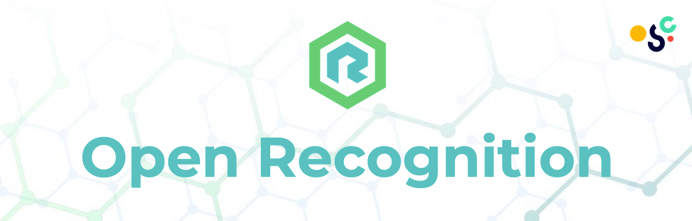
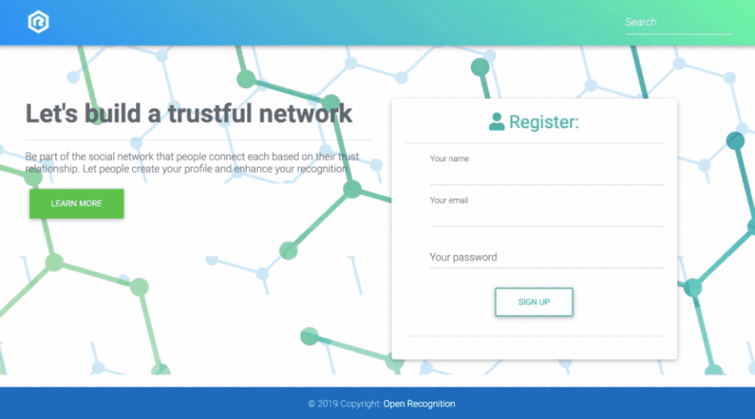

# [Open Recognition](https://lets.opentrust.be) (oSoc 2019)
Being expat, immigrant, student or refugee is quite troublesome especially when it comes to be recognized in a new place. Getting hired, rent an apartment, find a scholarship, basically trying to gain people trusts without a local network is the most difficult part of a settlement. 

Open Recognition is **social network** that helps newcomers to get recognition that they need to be part of community. The purpose of the app is helping users to collect trust statements, endorsements from other people. 

Open Recognition is **open-source** project that was being one of the projects in [Open Summer of Code](https://2019.summerofcode.be/2019/open-recognition) which is a 4-week summer programme in July. The goal: provide network and support necessary to transform open source/innovation projects into powerful real-world services.

## Technologies
For this project the following technologies were used:
- HTML, CSS, Bootsrap and React for front-end
- NodeJs for back-end
- PostgreSQL for database

## Installation

To install and run the project, follow these steps:

1. Clone the Git project off of GitHub:

`git clone git@github.com/ZHanimK/oSoc19-Open-Recognition-App.git`

2. Browse to the project folder in your terminal

`cd oSoc19-Open-Recognition-App`

3. Build the Docker image

`docker-compose build node`

4. Start the Docker container

`docker-compose up -d`

5. Browse client folder in project root in your terminal for install frontend

`cd client`

6. Build node packages and start

`npm install`
`npm start`

7. Browse src folder in project root in your terminal for install backend

`cd src`

8. to run it

`nodemon index.js`

Every time you add a Node.js dependency, you'll need to rerun the step 3. and 4.

## License 

This project is licensed under the MIT [License](LICENSE).

## Authors

- [Hanim Kapusuz](https://github.com/ZHanimK)
- [Wael Fato](https://github.com/waelslaam)
